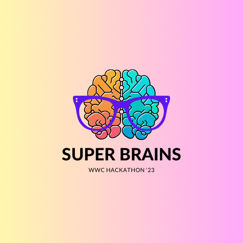
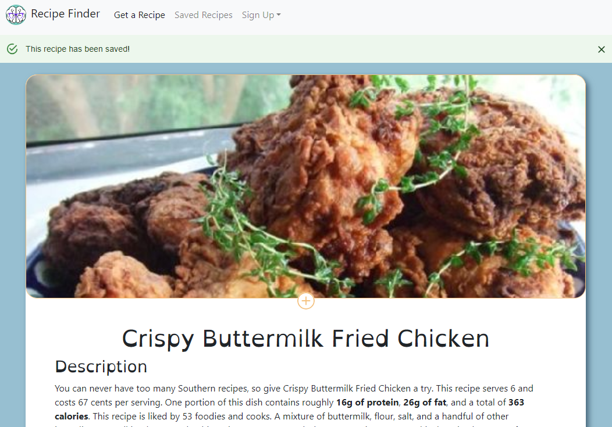

# Meal decider 

## Super Brains Team

* Jessica Perry - Team Lead
* Calico Seders - Technical Lead
* Elaine Serrano - Front End
* Ana Villalobos - Front End
* Chris Gruenhagen - Full Stack

##  Purpose/Mission
Women Who Code Hackathon for Social Good 2023 

    Many of us face challenges deciding about their next meal. But to some this minor inconvenience  can be completely debilitating. Sometimes to the point where it is a danger to ones health. With [ Food decider], we hope to cut down on the complexities and anxiety of meal decisions by providing only relevant data within the [ Food decider] app.Our app might not be able to completely solve the riddle of decision-stall but it can help with managing it. Making the meal decision easier for all.

We wanted to design a site to address ADHD Decision paralysis,  Dietary/Allergy management, and Food waste reduction.

## Description
 Our Recipe Finder app minimizes distractions by allowing users to swiftly select ingredients and presents recipes with minimal interruption, using a slot machine animation to maintain engagement. This approach optimizes the user’s path to finding  a recipe, minimizing interruptions and ensuring a user-friendly, distraction-focused experience. 

## Technologies Used

* JavaScript
* React
* Flask
* Python
* Bootstrap
* CSS
* iPassage
* MySQL

## Recipe Finder

https://super-brain-project-be6540d39f39.herokuapp.com/

## What We Learned
* Learned to created a complete web-app connecting front end with back end
* React Basics
* Setting up Flask Server
* Shared team knowledge
* Developed a deeper understanding of Git
* Effectively communicate with the team
Learned new web techonologies 

## Attribution
Recipe data obtained from the Spoonacular API.
https://spoonacular.com/food-api

## License

MIT

Copyright (c) SUPERBRAINS '23
